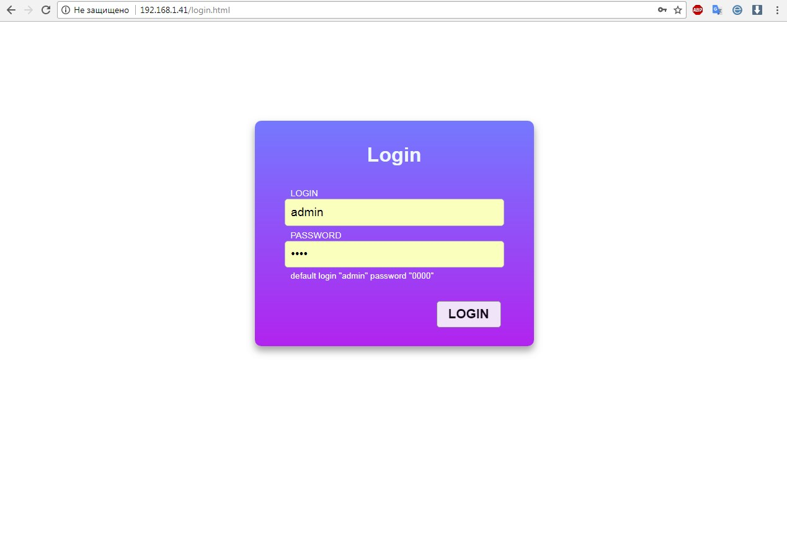
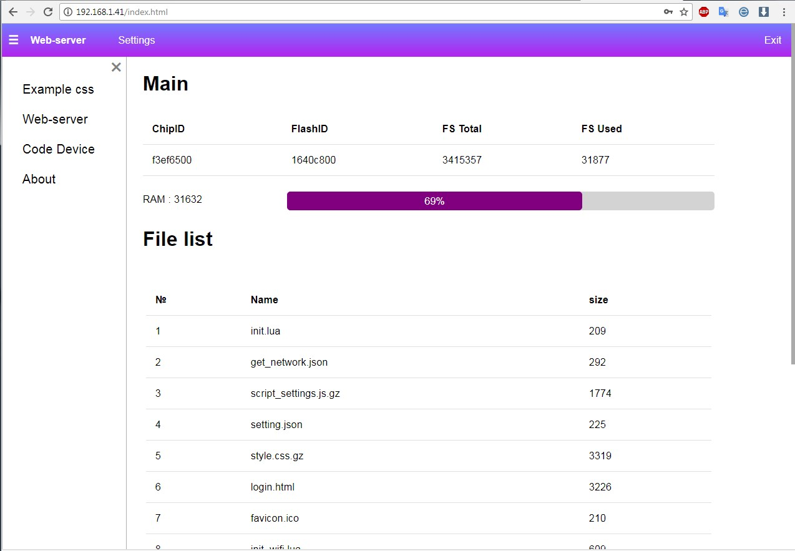
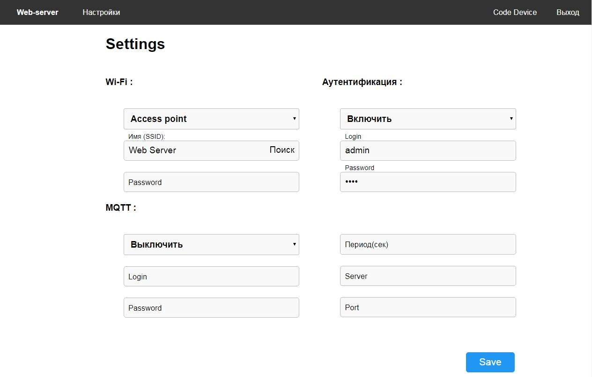

# web-server

Веб сервер для прошивок NodeMCU для ESP8266.   
Вернее это базовый шаблон для ваших проектов с веб интерфейсом.

[English](https://github.com/bondrogeen/web-server/blob/master/doc/en/README.md)

## Особенности

* GET, POST запросы
* Разбор форм (application/x-www-form-urlencoded и application/json)
* Возможность загрузки доп. файлов (js, css, ico,txt,jpg).
* Минимальный размер кода в памяти, в режиме ожидания.
* Возможность  включение LUA кода в HTML страницу. ( \<?lua return(node.chipid()) ?>)
* Запуск LUA скриптов и передача им параметров по средствам POST и GET запросов.
* Минимальная аутентификация.
* Возможность загрузки сжатых файлов (.gz).

## Структура

### Инициализация:
* init.lua - инициализации настроек и wi-fi.
* init_settings.lua - получение настроек, так же хранятся настройки по умолчанию.
* init_wifi.lua - подключение к wifi сети.

### Сервер состоит из четырех основных скриптов:
* web_server.lua - сам веб сервер.
* web_request.lua - разбор ответов от клиента.
* web_file.lua - передача файлов, запуск скриптов и загрузка html страниц с кодом lua.
* web_control.lua - аутентификация, сохранения параметров, получения списка точек доступа.

### Файлы:
* favicon.ico - иконка.
* index.html - главная страница.
* settings.html - страница настроек.
* login.html - страница аутентификация.
* script_settings.js.gz - js скрипт (сжатый) для обработки и отправки форм.
* style.css.gz - файл стилей (сжатый).

## Установка

1. Необходимые модули ("crypto", "file", "gpio", "net", "node", "sjson", "tmr", "uart", "wifi") далее на ваше усмотрение. [Собрать прошивку](https://nodemcu-build.com/)
2. Загрузить все [файлы](https://github.com/bondrogeen/web-server/tree/master/files) в модуль.
3. Подключиться к точке доступа **Web server** и перейти по адресу **192.168.4.1**.
			

			
4. Вводим логин (admin) и пароль (0000).
			

			
5. Переходим в **Настройки**.
			

6. Подключаемся к вашей wi-fi сети 

## Шаблон lua-скрипта для сервера

Пример файл "test.lua"

...lua   
   
Local function arg_to_str(val)    
  local str=""    
  for k, v in pairs(val) do     
    str=str..k.." : "..v.."     
  end    
  return str    
end   
    
return function (args)    
 return arg_to_str(args)   
end    
   
... 
   

Параметры от форм (если они есть) будут переданы в таблицу **args**.

http://IP/test.lua?key=value&name=Roman

## Ограничения.
Сервер обрабатывает файлы по разному, так для файлов с расширением .html чтение из файла идет построчное, это сделано для упрощения обработки встроенного Lua кода, на размер файла ограничений нет. C файлами с расширением .lua размер отправленных данных не более 4KB.
Все остальные файлы передаются побайтно (1024 байт за раз), также ограничений на размер файла нет. Сервер не может принимать данные более 1.4KB (данные + заголовок). Пока не было такой необходимости.)))
